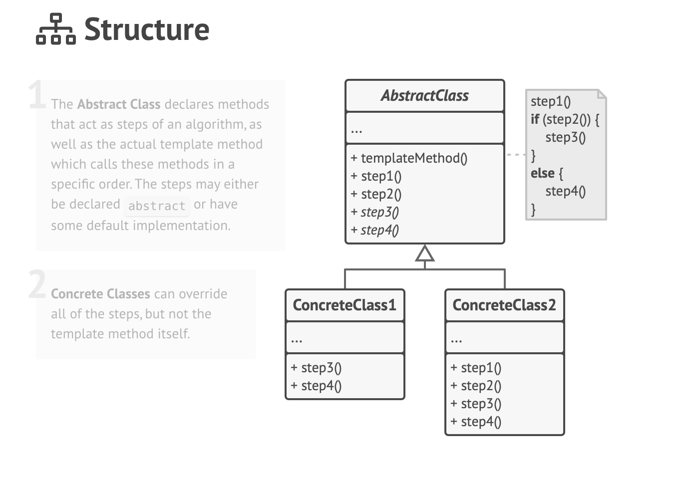
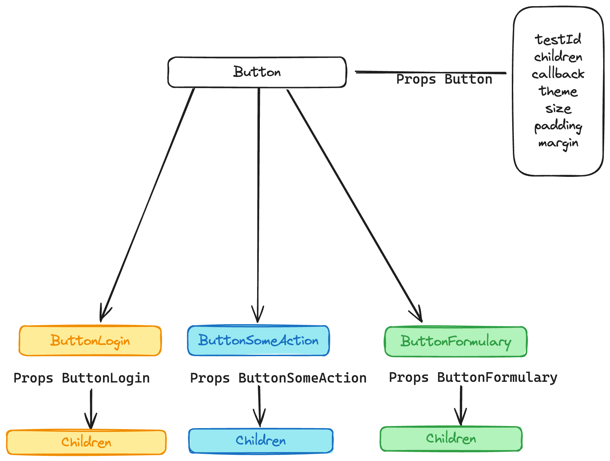

# Docs

<h4>

[1. Styles](#1-styles)

[2. Configuration](#2-configuration)

[3. Application Design](#3-application-design)

[4. Things I learned](#4-things-i-learned)

[5. Problems I found](#5-problems-i-found)

</h4>

# 1. Styles

### Media queries

- Mobile: 600px
- Tablet: 900px
- Desktop: Ahead from 900px

### System column

- Mobile: 4 columns
- Tablet: 8 columns
- Desktop: 12 columns

### Margins

- Mobile: 0.5rem;
- Tablet and Desktop: 0.75rem;

# 2. Configuration

### a) Prettier

> https://prettier.io/docs/en/install.html

- RULES:

```
{
  "useTabs": true,
  "semi": false,
  "trailingComma": "es5",
  "singleQuote": true,
  "quoteProps": "consistent",
  "bracketSpacing": true,
  "bracketSameLine": true,
  "arrowParens": "always",
  "htmlWhitespaceSensitivity": "css",
  "singleAttributePerLine": true
}

```

### b) React Router Dom

This will have some rules. (WIP)

### Husky

> https://www.npmjs.com/package/husky

### How to have more than one style:

``<h1 role={'presentation'} className={`full-span ${styles.h1}`}> Hello World! </h1>``

### RouterProvider vs ReactRouter

- _`<ReactRouter>`_ is NOT the same as `<RouterProvider>`. The first one doesn't let you use `createBrowserRouter` to
  create your paths. For that you should use
  `ProviderRouter` instead.

### Testing react router

<div id="test-react-router"></div>

It's **so different** from Angular. I was used to Angular's way to testing router using `RouterTestingHarness` that
was as easy as
adding your routes and that's all. But here you need, in some way, to **mock** the router since it doesn't know the
router context.

Let's see this example:

```
function LogoSessionTemplate() {
	return (
		<div className={styles.container}>
			<Link
				role={'link'}
				className={styles.link}
				to={'/login'}>
				
			</Link>
		</div>
	)
}
```

The premise of the test is the following: 'user should go to page `/login` when he clicks on the link'.

1. To afford that, first of all we need to **mock** the path:

```
LogoSession.spec.tsx

vi.mock('/login', () => ({
default: () => LoginTemplate,
}))

```

This is because **we are not using our router system**; that is, we dont _really have our ´´routes``associated
with`router`
Think in this like a **specific context**. Nothing **directly related** with this context **can be known**, and our
Router does not beloing \_directly_
to this space of test. So first, we **mock** the direction to associated with the element we desire to be renderer when
user click on the actual path.

2. In **ReactRouterDocs**

> https://v5.reactrouter.com/web/guides/testing

It speaks about **some advices** you can get because of using `<Link />` tag among other ones.

[x] In case you have **multiple routes**,they strongly recommend use `<MemoryRouter />`.
In chatgpt words:

> Yes, you can use <MemoryRouter> in your React
> tests when you want to simulate different routes and test the rendering
> of components within those routes,
> including what you might refer to as "outlets."
> In the context of React Router, an "outlet" is not a specific React Router
> component but rather a term often used in the React Router documentation and related discussions
> to describe the area of your application where the matched component for a route is rendered.
> This is often the area controlled by the <Switch> component.

One way or another, if you are using <Outlet /> or **multiple routes** you will need this tag.
Anyway, this is not the case so we can remove that instruction.

We'll use `<BrowserRouter>` insted;

```
			<BrowserRouter>
				<Routes>
					<Route
						path={'/'}
						element={<AppTemplate />}></Route>
					<Route
						path={'/login'}
						element={<LoginTemplate />}></Route>
				</Routes>
			</BrowserRouter>
```

> Docs:
> https://javascript.plainenglish.io/testing-react-router-with-react-testing-library-8e24f7bdca18 > https://medium.com/@Galaxy-Trek/how-to-test-routing-in-react-with-react-testing-library-652ee3b8c512 > https://stackoverflow.com/questions/70654872/how-to-test-react-router-v6-outlet-using-testing-library-react > https://v5.reactrouter.com/web/guides/testing > https://testing-library.com/docs/example-react-router/

> Now its time to develop the test.

```
	it('should set path /login when user is not logged and clicks on LogoSessionTemplate', async () => {
		render(
			<BrowserRouter>
				<Routes>
					<Route
						path={'/'}
						element={<AppTemplate />}></Route>
					<Route
						path={'/login'}
						element={<LoginTemplate />}></Route>
				</Routes>
			</BrowserRouter>
		)

		await userEvent.click(screen.getByRole('link'))

		await waitFor(() => {
			expect(screen.getByRole('form')).toBeInTheDocument()
		})
	})
```

```
render(
			<BrowserRouter>
				<Routes>
					<Route
						path={'/'}
						element={<AppTemplate />}></Route>
					<Route
						path={'/login'}
						element={<LoginTemplate />}></Route>
				</Routes>
			</BrowserRouter>
		)
```

In this step we configure our 'false' router to `mock` the real one.

We want to ensure that some elements are viewed if user changes its path. So:

```
	await userEvent.click(screen.getByRole('link'))
```

First of all we trigger the user's action.

```
		await waitFor(() => {
			expect(screen.getByRole('form')).toBeInTheDocument()
		})
```

Then we wait until the action is complete. After that, we can check if the actual component is rendering what we want.

This is a simple test, but a good first step to start our knowledge on this tests.

# 3. APPLICATION DESIGN

In this topic we'll talk about the **rules** and **design** applied to the application.

### Template Method

The structure of a `template method` is like this:



But we need to face some **problems** and take a different approach:

- First of all, this pattern is **based on classes**, and we are working with **function**. We cannot create abstract
  classes and nothing related with them. So, to face this we will create a **basic button template** which we'll act
  like de **superclass**.

Example:

```
function Button({ ...props }: ButtonProps) {
	return {
		render: () => {
			return (
				<button
					className={styles.link}
					role={'button'}
					data-testid={props.testId}
					onClick={props.callback}>
					{' '}
					{props.children}
				</button>
			)
		},
	}
}
```

Button is the **main renderer React.NodeObject** which will accept the children from the one who will use **Button**.
For example:

```
export const ButtonLoginTemplate = {
	action: {
		render: (children: JSX.Element) =>
			Button({ callback: sayHi, testId: 'submit', children }).render(),
	},
}

function sayHi() {
	console.log('hi')
}
```

**ButtonLoginTemplate** is an object who had a property call **action**. This **action** will "extend" the render from
de parent.

> Note: obviously is nos extended because **there is no parent class neither child class**, but this will a **rule** for
> our purposes.

`render` will use the `Button` parent as "basic template" and it will send to him a callback, because `onClick`
event from the parent will trigger the child's `function`.

Also the parent _holds all the basic styles_ for a button (in our application) and there is another properties
like `theme`,
`padding` or `margin` who can be overwritten.

So it exists a relationship like this:



# 4. THINGS I LEARNED

- a) <u>[How to test with React Router](#test-react-router)</u>

- b) <u>INVERSION OF CONTROL (IoC)</u>

In early days of computer software, you directly control the **flow of the program**. Now this is controlled by \*
\*frameworks\*\*

> Martin Fowler said:
>
> “Inversion of control is a common characteristic of frameworks,
> so saying that these lightweight containers (spring and pico container, etc.)
> are special because they use inversion of control is like saying my car is special because it has wheels.”

What means _inversion of control_ is common in frameworks? It means that sometimes you need to do some task (por
example, creating a component) and the _way_ to create
it es **determined** by the **framework**. That means _it has the flow of control_, because is expecting from you
_some specific code_

This not only undermine the fact that is pretty common, but it also put it as _normal thing_. Nowadays mostly we relied
on **dependency
injection** to work with Inversion of Control, but we will take another approach here.

> > Inversion of Control is a key part of what makes a framework different from a library. A library is essentially a
> > set of functions that you can call, these days usually organized into classes. Each call does some work and returns
> > control to the client whereas a framework does some work for you, you just need to plug your behavior into some
> > places
> > by either by subclassing or by plugging into your own classes. Then framework will call your code when it is
> > required.

- Note: Dependency Inversion Principle is **NOT** the same as Invertion of Control.

### Techniques

Some techniques to apply **Inversion of control**:

1. Using a service locator pattern
2. Using dependency injection pattern
3. Using a contextualized lookup
4. Using template method design pattern
5. Using strategy design pattern

The most commonly used patterns are 1 and 2. You can understand the differences between them in this
link https://medium.com/@amitkma/understanding-inversion-of-control-ioc-principle-163b1dc97454#:~:text=Let%E2%80%99s%20take%20an%20example.

> Docs: https://medium.com/@amitkma/understanding-inversion-of-control-ioc-principle-163b1dc97454

We will attack **Template method design pattern** (just because im curious about it).

### Template method design pattern

First of all: What is this method?

As the documentation explains: _its a skeleton created by two types of algorithms; the ones which are invariables (it
means no one can override the function), and the second ones which are variable (so, it can be override)_

Let's work with an example:

I have a button on the login page:


- **render** This function will be the one in charge of return de JSX.Element

> https://sourcemaking.com/design_patterns/template_method

# 5. PROBLEMS I FOUND

- `expect is not defined`

This happens when using vitest because jest use **globals** to define its expect. So we need to follow
this step: https://github.com/vitest-dev/vitest/issues/1504#issuecomment-1159668988.

Create a `setup.ts` file and add the following:

```
import matchers = require('@testing-library/jest-dom/matchers')
import { expect } from 'vitest'

expect.extend(matchers)

```

Also add to our `vitest.config.ts` (if you dont have it, create it)
this configuration:

```
export default mergeConfig(viteConfig, defineConfig({
test: {
globals: true,
setupFiles: ['./setup.ts'],
},
}))
```

This error will be solved.

- `document is not defined`

This happens because the test is running in the **DOM** `environment`, not in the **node**. So it needs
to know this environment.

First of all install jsdom:
`npm install jsdom`

and then put this on _each_ testing file you have:

```
/**
 * @vitest-environment jsdom
 */
```

Should look like this:

```
import {render, screen} from "@testing-library/react";
import '@testing-library/jest-dom'
import AppTemplate from "./App.template.tsx";
import {describe, expect, it} from "vitest";

/**
 * @vitest-environment jsdom
 */
describe('AppTemplate', () =>{
    it('should render Hello World', () => {
        render(<AppTemplate  />);

        expect(screen.getByRole('presentation')).toBeInTheDocument();
    })
})
```

This solves the error.

> Docs: https://dev.to/mbarzeev/from-jest-to-vitest-migration-and-benchmark-23pl

- `TypeError: Cannot destructure property 'basename' of 'React__namespace.useContext(...)' as it is null.`

It seems this happens when you are doing tests and you have used `<Link>` at any moment y your application. The solution
is to wrap your element in the test between `<BrowserRouter>`:

```
it('should render Hello World', () => {
		render(
			<BrowserRouter>
				<AppTemplate />
			</BrowserRouter>
		)

		expect(screen.getByRole('presentation')).toBeInTheDocument()
	})
```

The error will be solved.
